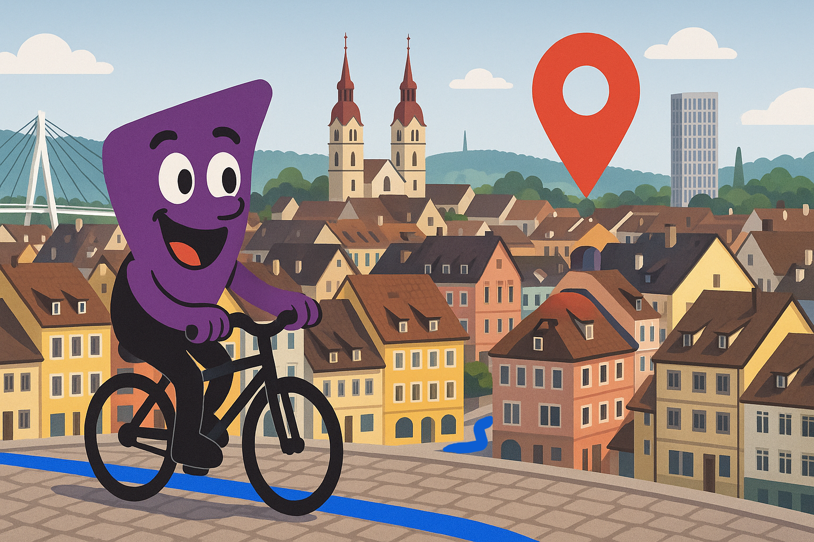
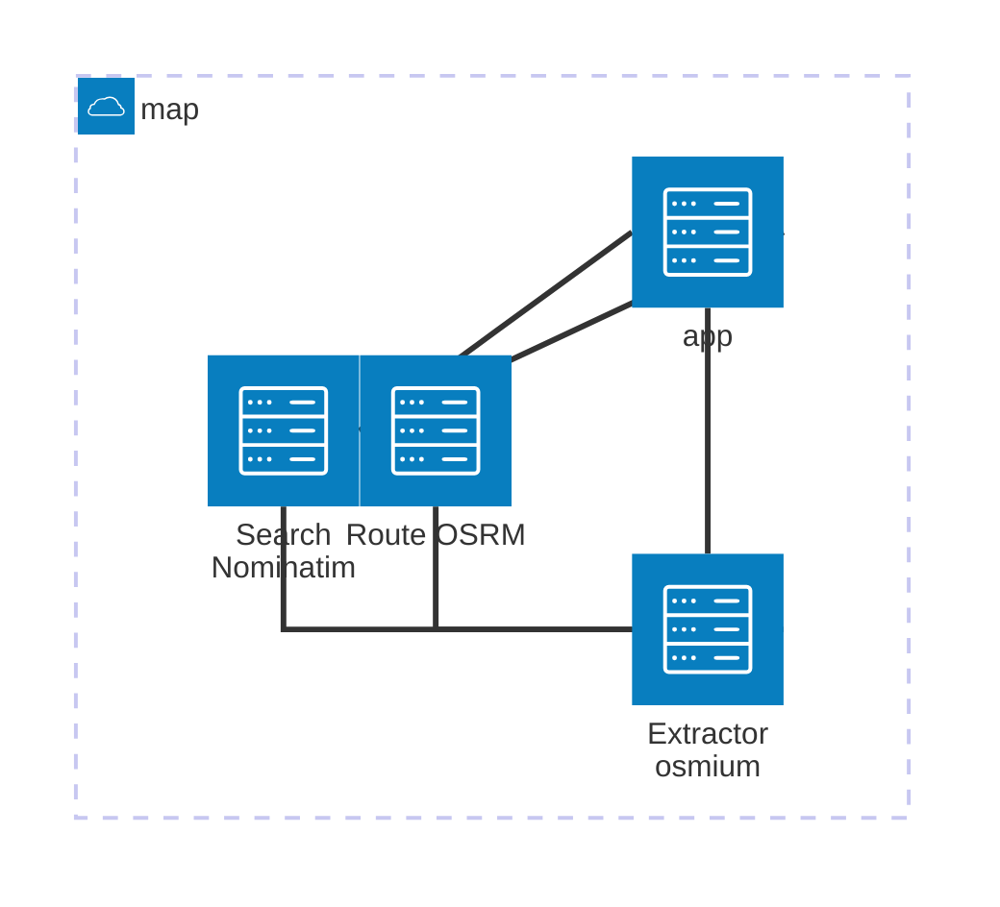

## map

*free geocoding and routing service for winterthur*




## cli

there is a cool cli:

```bash
 pipx install git+https://github.com/blemli/map.git
 map route problemli analogattack
```

> [!TIP]
>
> you can set your home with: `map config set home "<ADDRESS>"` and remove it with `map config reset home`.
> Afterwards you can omit the source when your at home and only do: `map route analaogattack`

for everything else see `map --help`


## osm export

There is a daily OSM-Export containing Winterthur County:

https://map.problem.li/data/winterthur.osm.pbf

```curl 
curl -L https://map.problem.li/data/winterthur.osm.pbf
```


## api

apps without an api are like milk without milk

- the `/route` endpoint (alias `/r`) calculates the quickest bicycle route between two points. If you only supply one point the start defaults to PHQ.

- the `/search` endpoint (alias`/s`) returns coordinates for an address (geocoding)

  ... and hopefully more to come (maybe `/open`?)


## deployment

is  as easy as:

```bash
gh repo clone blemli/map && cd map
kamal deploy
```


> [!NOTE]
>
> you might need to install some prerequisites first:`app install 1password 1password-cli ruby gh && gem install kamal`


## todo

nominatim replication url?


## development

don't be an egoist, contribute :heart:

here are some hints for you:

### an overview over the components




### the right tool for the right job

```bash
brew install osmium-tool gdal curl
```


| tool          | Job  | Beispiel                                      |
| ------------- | ---- | --------------------------------------------- |
| `osmium-tool` |      | osmium fileinfo --extended winterthur.osm.pbf |
| `gdal`        |      | `ogrinfo -ro -al -so winterthur.osm.pbf`      |
| `curl`        |      |                                               |

### get pbf of winterthur

```bash
curl "https://download.geofabrik.de/europe/switzerland-latest.osm.pbf" --output switzerland.osm.pbf
osmium extract --overwrite -b 8.6404,47.4389,8.8169,47.5616 -o winterthur.osm.pbf switzerland.osm.pbf
osmium export -o winterthur.geojson winterthur.osm.pbf
```

 

#### accessory needs to be deployed seperately

```bash
ACCESSORY="winterthur-extractor"
cd $ACCESSORY
docker build -t blemli/$ACCESSORY:latest .
docker push blemli/$ACCESSORY:latest
kamal accessory boot $ACCESSORY     # or: kamal accessory boot all
cd ..
kamal deploy
kamal accessory reboot $ACCESSORY
kamal accessory details $ACCESSORY
kamal accessory logs $ACCESSORY
```


## run nominatim locally for testing

```bash
docker run -it --rm \
  -v "$(pwd)/winterthur.osm.pbf:/nominatim/data/winterthur.osm.pbf" \
  -e PBF_PATH=/nominatim/data/winterthur.osm.pbf \
  -p 8080:8080 \
  --name nominatim \
  mediagis/nominatim:4.3
```


## run osrm locally for testing

```bash
docker run -t -v "${PWD}:/data" osrm/osrm-backend osrm-extract -p /opt/bicycle.lua /data/winterthur.osm.pbf

docker run -t -v "${PWD}:/data" osrm/osrm-backend osrm-partition /data/winterthur.osrm

docker run -t -v "${PWD}:/data" osrm/osrm-backend osrm-customize /data/winterthur.osrm

docker run -t -i -p 5000:5000 -v "${PWD}:/data" osrm/osrm-backend osrm-routed --algorithm mld /data/winterthur.osrm
```


## links

- [nominatim quickstart](https://www.afi.io/blog/building-a-free-geocoding-and-reverse-geocoding-service-with-openstreetmap/?ref=blog.afi.io)
- [Geofabrik pbf download of switzerland](https://download.geofabrik.de/europe/switzerland.html)
- [Osrm-backend on dockerhub](https://hub.docker.com/r/osrm/osrm-backend)
- [qgis for viewing .pbf files](https://qgis.org/)
- [draw bouding boxes](https://norbertrenner.de/osm/bbox.html)
